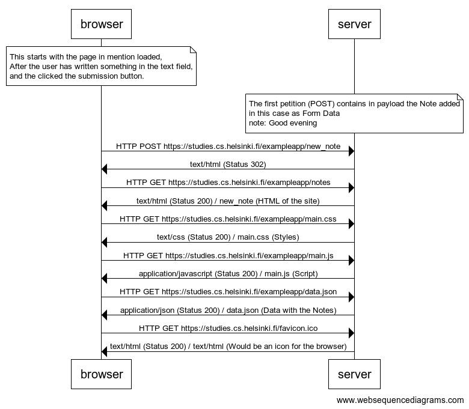
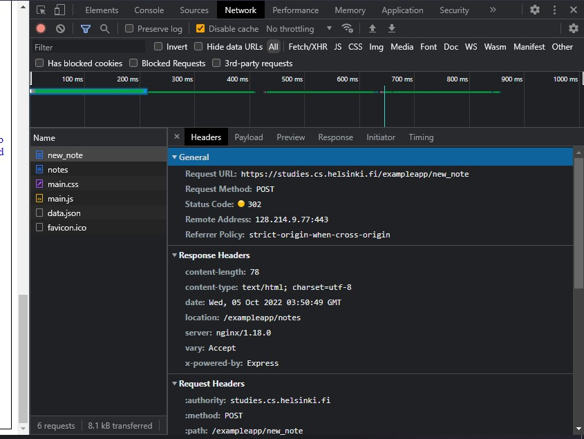
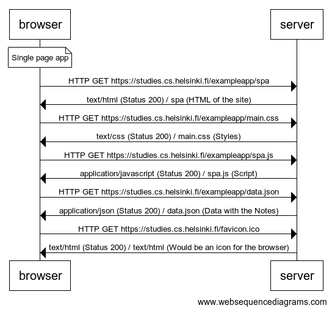
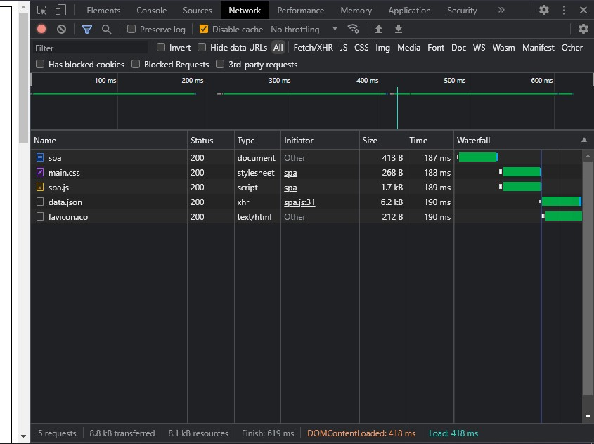
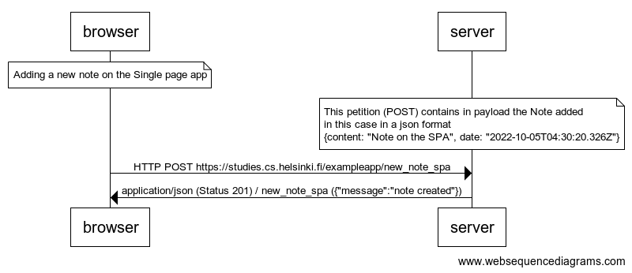
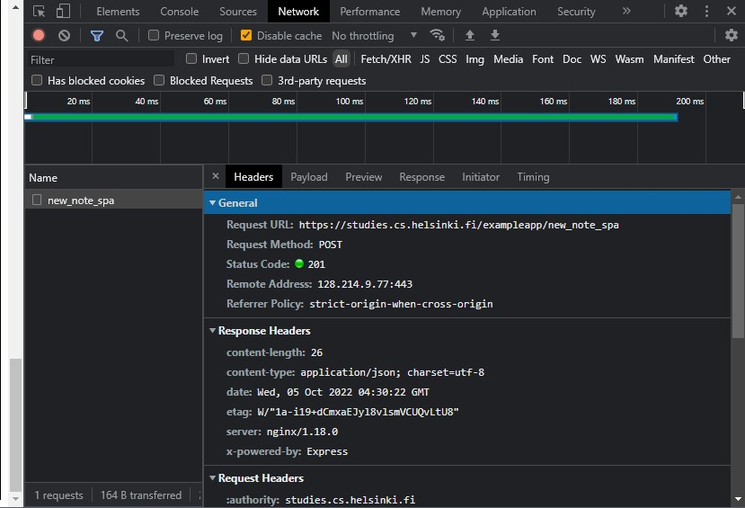

# 0.4: New note

Diagram with the events that ocurred when sending a new note to the site https://studies.cs.helsinki.fi/exampleapp/notes



```
note over browser:
This starts with the page in mention loaded,
After the user has written something in the text field,
and the clicked the submission button.
end note

note over server:
The first petition (POST) contains in payload the Note added
in this case as Form Data
note: Good evening
end note

browser->server: HTTP POST https://studies.cs.helsinki.fi/exampleapp/new_note
server->browser: text/html (Status 302)
browser->server: HTTP GET https://studies.cs.helsinki.fi/exampleapp/notes
server->browser: text/html (Status 200) / new_note (HTML of the site)
browser->server: HTTP GET https://studies.cs.helsinki.fi/exampleapp/main.css
server->browser: text/css (Status 200) / main.css (Styles)
browser->server: HTTP GET https://studies.cs.helsinki.fi/exampleapp/main.js
server->browser: application/javascript (Status 200) / main.js (Script)
browser->server: HTTP GET https://studies.cs.helsinki.fi/exampleapp/data.json
server->browser: application/json (Status 200) / data.json (Data with the Notes)
browser->server: HTTP GET https://studies.cs.helsinki.fi/favicon.ico
server->browser: text/html (Status 200) / text/html (Would be an icon for the browser)
```



###

# 0.5: Single page app

Diagram with the events that ocurred after accessing to the site https://studies.cs.helsinki.fi/exampleapp/spa



```
note over browser:
Single page app
end note

browser->server: HTTP GET https://studies.cs.helsinki.fi/exampleapp/spa
server->browser: text/html (Status 200) / spa (HTML of the site)
browser->server: HTTP GET https://studies.cs.helsinki.fi/exampleapp/main.css
server->browser: text/css (Status 200) / main.css (Styles)
browser->server: HTTP GET https://studies.cs.helsinki.fi/exampleapp/spa.js
server->browser: application/javascript (Status 200) / spa.js (Script)
browser->server: HTTP GET https://studies.cs.helsinki.fi/exampleapp/data.json
server->browser: application/json (Status 200) / data.json (Data with the Notes)
browser->server: HTTP GET https://studies.cs.helsinki.fi/favicon.ico
server->browser: text/html (Status 200) / text/html (Would be an icon for the browser)
```


###

# 0.6: New note

Diagram with the events that ocurred after adding a new note to the site https://studies.cs.helsinki.fi/exampleapp/spa



```
note over browser:
Adding a new note on the Single page app
end note

note over server:
This petition (POST) contains in payload the Note added
in this case in a json format
{content: "Note on the SPA", date: "2022-10-05T04:30:20.326Z"}
end note

browser->server: HTTP POST https://studies.cs.helsinki.fi/exampleapp/new_note_spa
server->browser: application/json (Status 201) / new_note_spa ({"message":"note created"})
```


